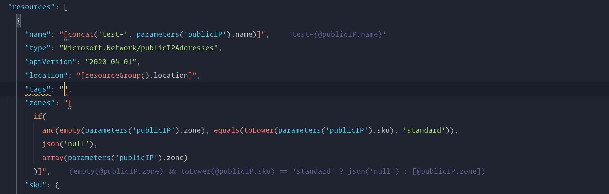

# ARM Template Read-Eval-Print Loop (REPL) for Visual Studio Code

A Visual Studio Code extension that enhances your ARM template editing experience with read-eval-print loop (REPL) support.

## Features

- Evalutates ARM template expressions file and gives live feedback as you type. Results are shown as decorations and are appended to the end of any line containing an expression.

- Provides type checking for built-in template expression functions.

## Dependencies

- [Azure Resource Manager (ARM) Tools](https://marketplace.visualstudio.com/items?itemName=msazurermtools.azurerm-vscode-tools)

## Extension Settings

Coming soon.
